# YOLO神经网络集成训练工具：Ver-2.0.0  
  
## 简介  
这是一个yolo神经网络集成训练工具，因为自己平常用yolo进行训练时总是会遇见一些标注、文件转换、设置配置文件、设置样本分配比例以及各种不同的训练任务与训练成果验证的问题，由于各个工具过于分散了，所以想着写一个集成的工具便于快速完成yolo训练工作区的搭建  
  
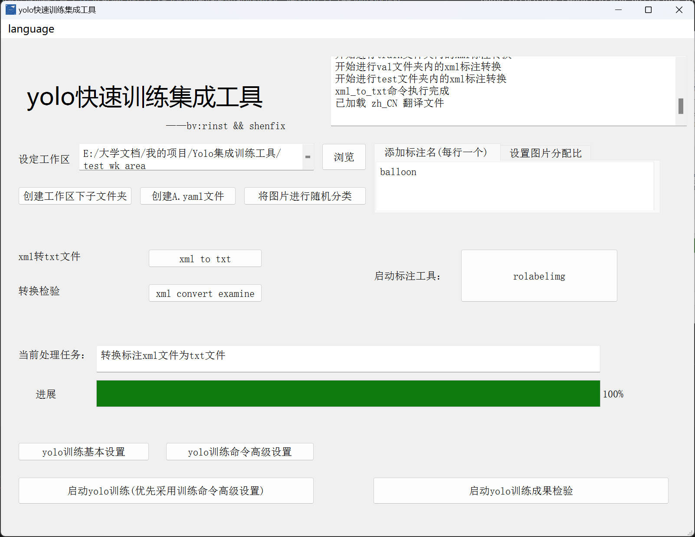

## 快速入门
### 环境
python=3.9~3.11  
pytorch  
ultralytics  
PyQt5
### 安装
方法一：使用pip安装
使用命令：
```cmd
pip install itto-yolo-tool
```
启动应用:
```cmd
itto
```

方法二：采用git克隆  
windows/linux/mac 输入以下命令：
```cmd
git clone https://github.com/RinST-Dreaming/Yolo-integrated-training-tool.git
```  
或者直接从main页面下载源代码.zip文件

在目录下运行以下命令:
```cmd
python setup.py install
``` 

启动应用:
```cmd
itto
```

### 使用方法
在使用之前，请确保你已经配置好了yolo训练环境！！！

启动：  
直接打开源代码文件夹，运行main.py文件就可以看见软件界面了  
  
训练步骤：  
1. 在本地创建一个文件夹，这个文件夹也就是你的yolo模型训练工作目录了  
    

2. 在设定工作区的右边点击“浏览”按钮，找到你创建的这个文件夹  
    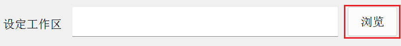

3. 点击“创建工作区下子文件夹”按钮，实现不同功能的文件夹的创建  
    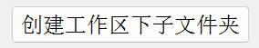
   - files_waiting_for_classify：存放你所有的数据集图片和标注文件，并等待随机分配到另外三类文件夹当中
   - train：存放用于yolo的训练数据集
   - val：存放yolo的验证数据集
   - test：存放yolo模型训练完之后用于人工验证的数据集
    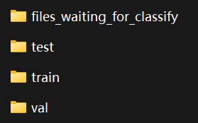

4. 将你准备训练的数据集全部拷贝进“files_waiting_for_classify”文件夹当中，按照以下规则分类到“files_waiting_for_classify”文件夹内部的文件夹：
   - images：存放图片数据
   - labels：存放标注的txt文件
   - labels_xml：存放标注的xml文件  
    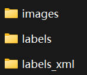
  
5. 如果你的图片还没有进行数据标注，点击“rolabelimg”按钮，启动“rolabelimg”标注工具，进行数据集标注，官网与教程如下：[rolabelimg](https://github.com/cgvict/roLabelImg)  
    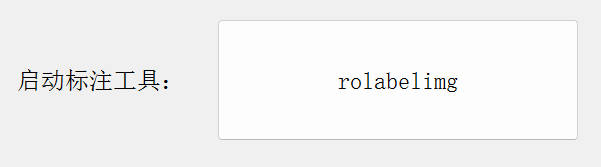

6. 在右侧找到“添加标注名”窗口，在里面输入你标注的模型名称，每行一个 
    

7. 点击“创建A.yaml”按钮创建配置文件  
    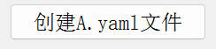

8. 点击“将图片随机分类”按钮，将“files_waiting_for_classify”文件夹按照一定比例分配到其它三类文件夹当中（分配比可以在右侧窗口配置）  
    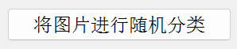
   
9.  点击“xml_to_txt”按钮，将rolabelimg标注的xml文件转换为yolo可以识别的txt文件  
    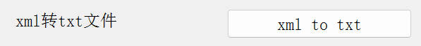

10. （可选）点击“xml_convert_examine”按钮，人工检验标注转换是否正确，按任意键切换下一张，按“q”键退出  
    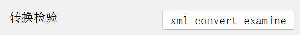

11. 配置yolo训练命令，如果你是刚入门yolo模型训练，推荐点击“yolo训练基本设置”，在里面有已经预设好的一些训练的参数；如果你想要自定义训练命令，可以点击“yolo训练命令高级设置”，该设置内部内容留空的话默认采用“训练基本设置”
    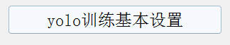
    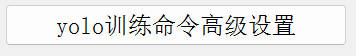

12. 点击“启动yolo训练”按钮，等待训练完成
    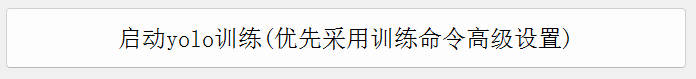

------等待训练结束，到这里就恭喜你成功完成一个yolo模型训练啦------

13.  （可选）将训练得到的“best.pt”文件拷贝到你的工作目录中，点击“启动yolo训练成果检验”按钮，人工检验模型的训练效果
    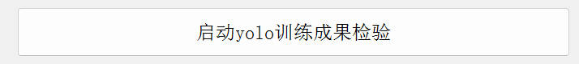


# 致谢与版权声明  
本项目使用了 [rolabelimg](https://github.com/cgvict/roLabelImg) 工具，该工具由 [cgvict 和 wkkmike] 开发，遵循 [MIT License] 许可证。  
由于rolabelimg项目长时间没有进行更新，我们创建了该项目的一个分叉[rolabelimg-fix](https://github.com/RinST-Dreaming/roLabelImg-fix)，对其继续进行维护与更新，并实际运用到该项目当中。再次对rolabelimg开源工作者表示感谢。  
感谢[rolabelimg_commits](https://github.com/cgvict/roLabelImg/pull/37)提供了更好的rolabelimg关于浮点型问题的报错解决思路
